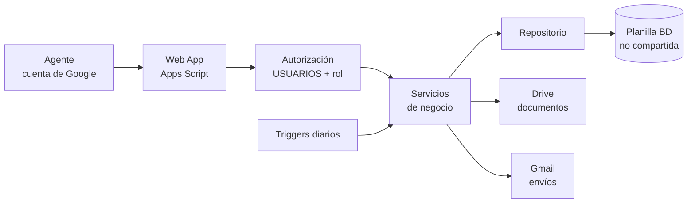
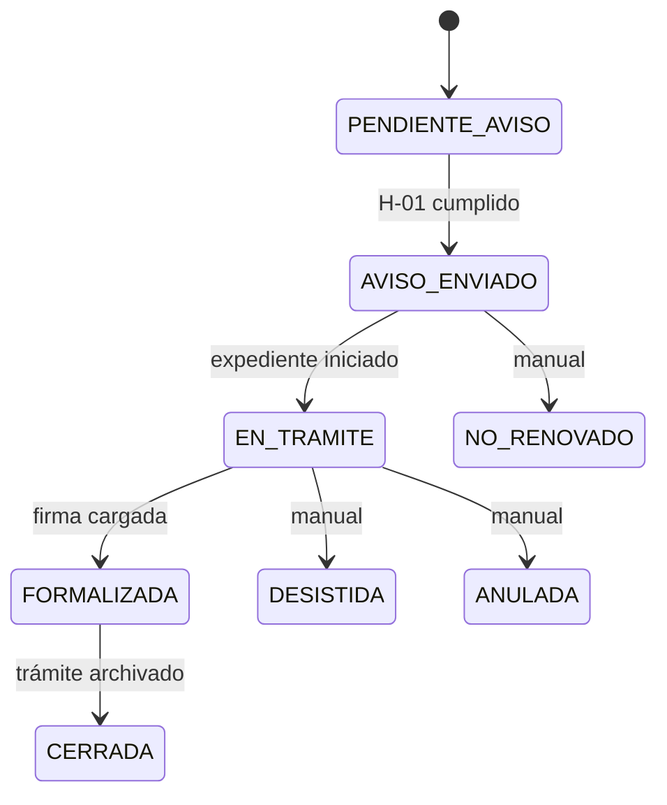

# PRD — App de Seguimiento de Gestión de Alquileres (EPESF)

Sep 24, 2026 · @Carlos

## 1. Resumen ejecutivo y objetivos

**Se construye una aplicación web sobre Google Apps Script y Google Sheets para que la Gerencia de Asuntos Jurídicos (GAJ) controle los contratos de alquiler en los que EPE es locataria: qué vence, qué renovación está en curso, qué hito falta y dónde hay riesgo de ocupar un inmueble sin contrato.** Este PRD está escrito para que una IA de desarrollo lo implemente sin decisiones de producto adicionales; lo que todavía no está decidido figura en la sección 12 con un valor por defecto.

Base de partida: el libro *Estructura\_Datos\_Gestion\_Alquileres.xlsx* (v0.1, 24/09/2026), con 18 tablas, sus reglas de integridad R1–R12 y las respuestas de Carlos a las 18 preguntas abiertas. Donde una respuesta cambia la estructura, esta versión la corrige y lo marca como **\[CAMBIO\]**.

### Objetivos

1. Registrar cada gestión (contrato nuevo o renovación, adenda, legítimo abono) sobre un inmueble, con su cadena histórica.
2. Anticipar vencimientos y hitos con alertas calculadas, no cargadas a mano.
3. Generar contratos y mails desde plantillas, guardar el enlace del contrato firmado y dejar trazabilidad de cada envío.
4. Dar a cada agente solo lo que su rol le permite, con identidad validada por cuenta de Google.
5. Ofrecer un dashboard de seguimiento y reportes exportables.

### Métricas de éxito

| Métrica | Situación actual | Meta a 90 días del go-live |
| --- | --- | --- |
| Avisos de 4 meses registrados sobre contratos por vencer | 5 de 184 filas | ≥ 95 % enviados desde la app dentro del plazo |
| Contratos vencidos sin sucesora, sin NO\_RENOVADO y sin legítimo abono | No se detecta | 0 sin alerta A5 visible en el dashboard |
| Tiempo para responder "¿qué vence en los próximos 120 días?" | Filtrar y recalcular el Excel | < 30 segundos, desde el dashboard |
| Gestiones nuevas cargadas fuera de la app | Todas en el Excel | 0 |
| Registros que violan R1–R12 (reporte de calidad de datos) | Sin control | 0 en tablas nuevas |

### No es objetivo

La app no controla pagos mensuales, no calcula el canon actualizado, no reemplaza al sistema de expedientes y no gestiona contratos en los que EPE es locadora.

## 2. Contexto, problema y alcance

**Hoy el seguimiento vive en un Excel cuyo ID no es único y donde casi no hay hitos registrados; la app debe arrancar con una estructura confiable y con el seguimiento como función central.** Los hallazgos medidos sobre 184 filas: 47 IDs repetidos (hasta 23 veces) y 23 filas "S/D"; 29 casos de legítimo abono sin período ni monto; 5 avisos de 184 registrados; 32 filas con dos o más locadores; la renovación se infiere con una fórmula frágil (columna *Renovacion*).

### Modelo conceptual (sin cambios)

INMUEBLE → EXPEDIENTE → ACTUACIÓN. Un expediente pertenece a un solo inmueble; un inmueble tiene varios expedientes; un expediente reune varias actuaciones. Actuación = CONTRATO (inicial o renovación), ADENDA o LEGITIMO\_ABONO. Las actuaciones se encadenan con `actuacion_anterior_id`. Una actuación puede existir antes de que haya expediente (aviso a 4 meses).

### Decisiones de Carlos que este PRD trata como cerradas

| Tema | Decisión |
| --- | --- |
| Canon | Siempre mensual, en pesos. Se guarda canon inicial + regla de actualización; no el cronograma ni cada actualización. |
| IVA | Se registra si el canon incluye IVA o no; depende de la condición fiscal del locador. Para comparar y analizar, el IVA no se considera (se trabaja en neto). |
| Plazos de 5 y 7 días | Días **hábiles**. Requiere calendario de feriados. |
| Adenda y legítimo abono | Sin flujo de hitos: solo información. La adenda se asocia siempre a un contrato. El legítimo abono se asocia siempre a una gestión vieja y a una renovación; su período es el que queda en el medio. Ambos, siempre a un inmueble. |
| Respuestas previas | La sucursal y la gerencia responden por separado; sus fechas pueden coincidir o no. |
| ID de la gestión | Lo genera el sistema automáticamente. |
| Vencimiento efectivo | El mayor `fecha_fin` entre el contrato y sus adendas no anuladas. |
| Estados | Se agrega NO\_RENOVADO. El catálogo de estados es editable por el administrador. |
| Áreas | EIRBI y Área Asesoramiento dependen de GAJ. |
| Personas y jefaturas | Se registra SUCESION y teléfono; se conserva domicilio y mail por contrato; historial de jefaturas con vigencia. |
| Tipo de actuación | Se crea siempre como CONTRATO al enviar el aviso; el tipo puede cambiar antes de formalizar. |
| Expedientes | Dos sistemas de numeración: `1-AAAA-N` y `EE-AAAA-NNNNNNNN-APPSF-OD`. |
| Migración de la hoja *Alq* | Al final de todo el desarrollo. |
| Locadora | Solo contratos donde EPE es locataria. |

### Alcance de la primera versión (MVP)

Gestión de inmuebles, expedientes, personas y actuaciones; hitos y alertas; generación de contratos, adendas y mails; enlace de documentos; roles y permisos; dashboard; reportes; auditoría; copia de seguridad diaria.

### Fuera de alcance

Pagos y actualizaciones aplicadas; cláusulas de rescisión y prórroga (dato adicional D1); datos físicos del inmueble (D2); imputación presupuestaria (D3); acceso de sucursales y gerencias (siguen respondiendo por mail); migración de datos históricos (etapa posterior, ver sección 11).

## 3. Usuarios, roles y permisos

**El acceso es por lista blanca: solo entra quien tenga su cuenta de Google registrada y activa en la hoja USUARIOS, y cada función del servidor verifica el rol antes de leer o escribir.** Ocultar botones en la pantalla es solo comodidad; la barrera real es el servidor.

### Roles

| Rol | Quién | Puede |
| --- | --- | --- |
| ADMINISTRADOR | Responsable técnico/funcional de la app (mínimo 2 activos) | Todo, incluida la administración de usuarios, catálogos, parámetros, plantillas, feriados y auditoría. |
| GESTOR | Abogados y personal de GAJ que llevan las gestiones | Crear y editar inmuebles, expedientes, personas, actuaciones, hitos, actos y documentos; preparar y enviar comunicaciones; generar contratos. |
| SUPERVISOR | Jefaturas de GAJ | Lectura total, exportar reportes, anular registros, reasignar responsables, ver el registro de cambios. No carga datos operativos. |
| LECTOR | Consulta (por ejemplo, otra gerencia autorizada) | Ver dashboard y fichas. Sin datos personales de locadores y sin exportar. |

### Matriz de permisos

L = leer, C = crear, E = editar, B = baja lógica o anulación, — = sin acceso.

| Módulo | ADMINISTRADOR | GESTOR | SUPERVISOR | LECTOR |
| --- | --- | --- | --- | --- |
| Dashboard | L | L | L | L |
| Ficha de actuación / inmueble / línea de tiempo | L | L | L | L (datos personales enmascarados) |
| Inmuebles, expedientes, actuaciones | L C E B | L C E | L B | L |
| Personas y partes (locadores) | L C E B | L C E | L | — |
| Hitos (cumplir, reprogramar, marcar NO\_APLICA) | L C E | L C E | L | L |
| Cambio de estado a DESISTIDA o NO\_RENOVADO | E | E | E | — |
| Cambio de estado a ANULADA | E | — | E | — |
| Actos administrativos y documentos (adjuntar enlace) | L C E B | L C E | L | L |
| Generar contrato, adenda o mail desde plantilla | C | C | — | — |
| Enviar comunicaciones | C | C | — | — |
| Reportes: ver | L | L | L | L (solo agregados) |
| Reportes: exportar con datos personales | Si | Si | Si | No |
| Contactos EPE y localidades | L C E B | L C E | L | L |
| Áreas, catálogos, hitos y plazos, plantillas, feriados, parámetros | L C E B | L | L | — |
| Usuarios y roles | L C E B | — | — | — |
| Registro de cambios (LOG\_CAMBIOS) | L | — | L | — |
| Copia de seguridad y restauración | Si | — | — | — |

### Reglas de acceso

1. **RA-1.** Una cuenta que no esté en USUARIOS, o esté con `activo = FALSE`, ve solo una pantalla de "Acceso no autorizado" y no recibe ningún dato. El intento se registra.
2. **RA-2.** El email se normaliza a minúsculas y sin espacios antes de comparar. No hay contraseñas propias: la identidad la valida Google.
3. **RA-3.** El enmascarado de LECTOR (`dni`, `cuit_cuil`, `domicilio_legal`, `mail`, `telefono`) se aplica en el servidor, antes de enviar la respuesta.
4. **RA-4.** No se puede desactivar ni degradar al último ADMINISTRADOR activo, ni el propio usuario puede cambiarse el rol.
5. **RA-5.** Toda alta, cambio de rol o baja de usuario queda en LOG\_CAMBIOS.
6. **RA-6.** La planilla de base de datos y la carpeta de documentos no se comparten con los agentes por Drive. Solo la app escribe en la planilla (sección 4).

### Tabla nueva: USUARIOS

| Campo | Tipo | Reglas |
| --- | --- | --- |
| `email` | Texto, PK | Cuenta de Google, minúsculas, única. |
| `nombre` | Texto | Obligatorio. |
| `rol` | Lista | ADMINISTRADOR, GESTOR, SUPERVISOR, LECTOR. |
| `activo` | Sí/No | Baja lógica. |
| `ultimo_acceso` | Fecha y hora | Lo completa la app. |
| Campos de control |  | `creado_en`, `modificado_en`, `modificado_por`. |

## 4. Arquitectura y stack técnico

**La app es una Web App de Google Apps Script que se ejecuta con la cuenta del propietario y usa una planilla de Google Sheets como única base de datos, no compartida con los agentes.** Así la app es la única puerta de escritura y las reglas de integridad se pueden hacer cumplir; en Sheets nada impide por sí solo romper una relación.



La Web App recibe la petición, identifica al usuario, valida el rol y recién entonces llama a los servicios de negocio; los triggers diarios recalculan alertas, envían el resumen y hacen la copia de seguridad.

### Stack

| Capa | Tecnología | Notas para el desarrollo |
| --- | --- | --- |
| Backend | Google Apps Script (runtime V8), publicado como Web App | Código en repositorio Git, sincronizado con `clasp`. Se permite TypeScript compilado. |
| Base de datos | Google Sheets (una planilla por ambiente) | Estructura del libro v0.1 + cambios de este PRD. Sin fórmulas ni celdas combinadas en hojas de datos. |
| Frontend | `HtmlService`, una sola página, JavaScript sin framework pesado | Gráficos con Chart.js desde `cdn.jsdelivr.net`. Diseño adaptable a celular. |
| Documentos | Google Docs (plantillas) + Drive | Reemplazo de etiquetas con la API de Docs/`DocumentApp`; salida en Drive. Reemplaza a AutoCrat. |
| Mails | `GmailApp` desde la cuenta del propietario | El remitente es la casilla de GAJ (`remitente_mail_gaj`). |
| Tareas programadas | Triggers por tiempo | Ver sección 10. |
| Ambientes | DEV y PROD, cada uno con su planilla, carpeta y Web App | El ID de la planilla vive en `PropertiesService`, nunca en el código. |

### Identidad: decisión a validar antes de programar

`Session.getActiveUser().getEmail()` devuelve el correo de quien abre la Web App **solo si** esa persona pertenece al mismo dominio de Google Workspace que el propietario del script; con cuentas @gmail.com personales de otro dominio devuelve vacío. Por eso la Fase 0 incluye una prueba técnica obligatoria (sección 11) y la implementación depende del resultado:

| Escenario | Mecanismo |
| --- | --- |
| A. Todos los agentes están en el mismo dominio Workspace que el propietario | Web App "Ejecutar como: yo", "Acceso: cualquier usuario del dominio". Identidad = `Session.getActiveUser().getEmail()`. **Camino recomendado.** |
| B. Hay cuentas @gmail.com personales o de otros dominios | Inicio de sesión con Google (ID token) en el frontend y verificación del token en el servidor contra el endpoint `tokeninfo` de Google, comprobando `aud`, `exp` y `email_verified`. Si no funciona dentro del iframe de Apps Script, alojar el frontend fuera (Firebase Hosting o Cloud Run) y dejar Apps Script como API. |

En ambos casos vale RA-1: la lista blanca en USUARIOS decide, no el dominio.

### Integridad, concurrencia y rendimiento

1. Toda escritura pasa por una función del servidor que toma `LockService.getScriptLock()` (espera máxima 30 s), valida, escribe y libera.
2. Los IDs los genera el servidor con la hoja `CONTADORES` (prefijo, último número) dentro del mismo bloqueo. Nunca se reutilizan (R1).
3. Lecturas en bloque (`getValues` de la hoja completa) con caché en `CacheService` (fragmentos de menos de 100 KB, vigencia 5 minutos), invalidada en cada escritura.
4. Se normaliza texto (trim) y se validan tipos antes de escribir; DNI, CUIT, partida y número de expediente se guardan como texto.
5. Volumen previsto: unas 200 gestiones y unas 4.000 filas de hitos, muy por debajo del límite de 10 millones de celdas por planilla. La estructura se traslada sin cambios a una base relacional si el proyecto crece.

### Límites de plataforma que el desarrollo debe respetar

| Límite | Valor aproximado | Consecuencia |
| --- | --- | --- |
| Duración de una ejecución | 6 minutos | Trabajos largos (copias, reportes grandes) en pasos. |
| Envío de mails | \~100 diarios en cuentas personales, \~1.500 en Workspace | Suficiente para el volumen esperado; la app cuenta los envíos y avisa antes del tope. |
| Almacenamiento por clave de caché | 100 KB | Fragmentar. |

Las cuotas exactas de Google cambian: el desarrollador debe verificarlas en la documentación oficial al iniciar.

## 5. Modelo de datos

**El libro *Estructura\_Datos\_Gestion\_Alquileres.xlsx* v0.1 es el Anexo A de este PRD y define cada campo (hoja DICCIONARIO), catálogo y relación (hoja MODELO); este PRD lo modifica solo en lo que sigue. Ante cualquier contradicción, prevalece este PRD.** Se mantienen las 18 tablas, los prefijos de ID, las convenciones de Sheets (una hoja = una tabla, encabezados en minúscula con guion bajo, campos nuevos siempre al final, sin fórmulas ni celdas combinadas) y las reglas R1–R12.

### Cambios respecto de v0.1

| # | Elemento | Cambio | Origen |
| --- | --- | --- | --- |
| M1 | USUARIOS (tabla nueva) | `email` PK, `nombre`, `rol`, `activo`, `ultimo_acceso` + campos de control. Ver sección 3. | Roles y Gmail |
| M2 | FERIADOS (tabla nueva) | `fecha` (PK, fecha), `descripcion`, `ambito` (NACIONAL, PROVINCIAL, OTRO), `activo`. Base del cómputo de días hábiles. | Respuesta #3 |
| M3 | CONTADORES (tabla nueva) | `prefijo` (PK), `ultimo_numero`. La usa el generador de IDs. | Respuesta #6 |
| M4 | LOG\_CAMBIOS | Pasa de opcional a **obligatoria**. Se escribe en toda alta, modificación y baja. | Roles y auditoría |
| M5 | ACTUACIONES | Agregar al final `responsable_email` (FK a USUARIOS; a quién de GAJ está asignada la gestión) y `motivo_estado` (texto; obligatorio al pasar a DESISTIDA, NO\_RENOVADO o ANULADA). | Seguimiento por agente |
| M6 | ACTUACIONES.canon\_inicial | Se documenta como **monto mensual en pesos**. No se renombra. | Respuesta #1 |
| M7 | PERSONAS | Agregar al final `condicion_fiscal` (lista opcional: RESPONSABLE\_INSCRIPTO, MONOTRIBUTO, EXENTO, OTRA). | Respuesta #2 |
| M8 | HITOS | H-02 pasa a `RESPUESTA_SUCURSAL` (nombre: Respuesta de la sucursal). Se agrega H-21 `RESPUESTA_GERENCIA` (Respuesta de la gerencia), etapa PREVIA. Son independientes: sus fechas pueden coincidir o no. Como todavía no hay datos cargados, el cambio de código es admisible. | Respuesta #5 |
| M9 | CFG\_HITOS\_TIPO | H-02, H-21 y H-03: `computo_dias = HABILES`. H-21 con las mismas condiciones de plazo que H-02 (valor por defecto a confirmar). El campo `orden` se reasigna para que H-21 quede tercero. | Respuestas #3 y #5 |
| M10 | ACTUACION\_HITOS | Agregar al final `reprogramada` (Sí/No). Si es TRUE, la app no recalcula `fecha_prevista`. | Regla R13 |
| M11 | CATALOGOS | Agregar `estado_actuacion.NO_RENOVADO`. Agregar la columna `es_sistema` (Sí/No, al final): los valores de sistema no se pueden desactivar ni cambiar de código. Nuevos catálogos: `rol_usuario`, `condicion_fiscal`, `ambito_feriado`. Los catálogos son editables por el administrador desde la app. | Respuesta #8 |
| M12 | AREAS | AR-24 (EIRBI) y AR-25 (Área Asesoramiento) pasan a tener `area_padre_id = AR-06`. | Respuesta #10 |
| M13 | ACTUACIONES.actuacion\_id | Es el código visible de la gestión y lo asigna el sistema. `codigo_legado` queda oculto para los usuarios comunes: solo lo completa el ADMINISTRADOR o la migración. | Respuesta #6 |
| M14 | PARAMETROS | Agregar: `alicuota_iva` (21), `semaforo_umbral_1_dias` (180), `semaforo_umbral_2_dias` (120), `semaforo_umbral_3_dias` (60), `hora_resumen_diario` (07:00), `retencion_backups_dias` (30), `tope_mails_diarios`. | Dashboard y operación |

### Validaciones obligatorias en el servidor

| Campo | Regla |
| --- | --- |
| `nro_expediente` | Dos formatos válidos: `^1-\d{4}-\d+$` y `^EE-\d{4}-\d+-APPSF-OD$`. Único entre expedientes activos. El sistema de origen se deduce del patrón, no se guarda. |
| `partida_inmobiliaria` | Formato `NN-NN-NN-NNNNNN/NNNN-N`, única entre inmuebles activos cuando se informa. |
| `dni` | Solo dígitos, 7 u 8. |
| `cuit_cuil` | 11 dígitos, con dígito verificador (módulo 11). Se guarda con guiones. |
| `plazo_meses` | Entero mayor que 0. |
| `fecha_fin` | Mayor o igual que `fecha_inicio`. Por defecto `fecha_inicio` + `plazo_meses` − 1 día; editable con motivo en `observaciones` (R5). |
| `canon_inicial` | Número mayor que 0, sin símbolo ni separadores. |
| `url_documento` | Debe ser un enlace `https://` de `drive.google.com` o `docs.google.com`. |
| `mail` (personas y contactos) | Formato válido; los contactos EPE, dominio `epe.santafe.gov.ar`. |
| Campos de lista | Deben existir y estar activos en CATALOGOS. |
| Fechas | Fecha real, nunca texto. |
| Espacios | Se recortan al inicio y al final antes de guardar. |

## 6. Reglas de negocio

**El servidor hace cumplir R1–R12 del libro y las reglas siguientes; ninguna se deja librada a la pantalla.** Las que reemplazan o amplían al libro se marcan con **\[CAMBIO\]**.

### Reglas nuevas o modificadas

| Código | Regla |
| --- | --- |
| R3' **\[CAMBIO\]** | **Cadena de actuaciones por tipo.** CONTRATO: `actuacion_anterior_id` vacío (primero del inmueble) o apunta a un CONTRATO o LEGITIMO\_ABONO del mismo inmueble. ADENDA: `actuacion_anterior_id` obligatorio y apunta al CONTRATO que modifica; nunca una actuación puede tomar una ADENDA como anterior. LEGITIMO\_ABONO: `actuacion_anterior_id` obligatorio y apunta al CONTRATO cuyo vencimiento originó el período; el contrato de renovación que le sigue apunta al legítimo abono (cadena A → LA → B). Mismo inmueble, sin ciclos. |
| R3a | **Insertar legítimo abono.** Si al vencer A ya existe una renovación B que apunta a A, la app inserta el LA en la cadena de forma atómica: `LA.anterior = A` y `B.anterior = LA`. |
| R4' **\[CAMBIO\]** | Al pasar a FORMALIZADA son obligatorios: `fecha_inicio`, `plazo_meses`, `fecha_fin`, `canon_inicial`, `condicion_iva_canon`, destino y firmante de EPE. (Se suma `condicion_iva_canon`, porque el análisis en neto depende de ella.) Para LEGITIMO\_ABONO: período, monto y acto administrativo. |
| R7' **\[CAMBIO\]** | Los plazos `ANTES_FIN_CONTRATO` se cuentan desde el **vencimiento efectivo** del último CONTRATO de la cadena (se salta el LEGITIMO\_ABONO). Si la actuación se crea con un LA como anterior (renovación retroactiva), los hitos de etapa PREVIA se generan en NO\_APLICA. |
| R13 | **Cálculo de fechas previstas.** Plazo en MESES: fecha calendario (EDATE). Plazo en DIAS con `HABILES`: se cuentan días de lunes a viernes que no estén en FERIADOS activos; el día de referencia es el día 0. `DESPUES_HITO` usa la `fecha_cumplimiento` del hito de referencia y, si todavía no se cumplió, su `fecha_prevista`. Se recalcula al cumplirse o reprogramarse el hito de referencia, o al cambiar el vencimiento efectivo, salvo `reprogramada = TRUE`. Si el año no tiene feriados cargados, se calcula solo con fines de semana y se marca "cómputo aproximado". |
| R14 | **Estado derivado de los hitos** (solo CONTRATO): PENDIENTE\_AVISO al crear; AVISO\_ENVIADO con H-01 cumplido; EN\_TRAMITE con expediente asignado y H-05 cumplido; FORMALIZADA con H-15 cumplido (si R4' lo permite); CERRADA con H-20 cumplido. Si se borra una fecha de cumplimiento, el estado retrocede. DESISTIDA, NO\_RENOVADO y ANULADA se marcan a mano con `motivo_estado`; solo un ADMINISTRADOR los reabre. ADENDA y LEGITIMO\_ABONO no tienen hitos: usan EN\_TRAMITE, FORMALIZADA, CERRADA y ANULADA cargados a mano. |
| R15 | **Vencimiento efectivo** = mayor `fecha_fin` entre el CONTRATO y sus ADENDAS no anuladas. Es el dato que vigilan alertas y dashboard. |
| R16 | **Canon neto de IVA para análisis.** SIN\_IVA y MAS\_IVA: el canon ya es neto. IVA\_INCLUIDO: se divide por 1 + `alicuota_iva`/100. Sin condición informada: el contrato queda fuera de los totales y se cuenta aparte como "sin dato de IVA". |
| R17 | **Tipo de actuación.** Al cambiar CONTRATO por ADENDA o LEGITIMO\_ABONO, los hitos cumplidos se conservan y los pendientes pasan a NO\_APLICA con la observación "cambio de tipo". |
| R18 | **Hitos condicionales.** H-03 (reiteración) pasa a NO\_APLICA cuando H-02 y H-21 están cumplidos. H-04 (carta documento) pasa a NO\_APLICA si hay un documento PROPUESTA\_LOCADOR o si un GESTOR la marca con motivo. H-02 (respuesta de la sucursal) pasa a NO\_APLICA si el sector interesado no es de tipo SUCURSAL (por ejemplo, gerencias de Infraestructura o Explotación). |
| R19 | **Canon vigente de un contrato con adendas** = `canon_inicial` de la actuación más reciente (por `fecha_inicio`, no anulada) que lo informe entre el contrato y sus adendas. Siempre se rotula "canon inicial informado", no "canon actual". |
| R20 | **Catálogos editables.** El ADMINISTRADOR puede agregar valores, cambiar descripción y orden y desactivar los que no son de sistema (`es_sistema = FALSE`). No puede cambiar el código de un valor en uso ni desactivar uno de sistema. |

Fórmula de R16 para IVA\_INCLUIDO:

```latex
canon\_neto = \frac{canon\_inicial}{1 + alicuota\_iva / 100}
```

### Estados de la actuación (CONTRATO)



NO\_RENOVADO (el contrato vence y no se renueva) y DESISTIDA (se abandona una gestión ya iniciada) también pueden marcarse desde PENDIENTE\_AVISO y AVISO\_ENVIADO. ANULADA se usa para cargas por error.

### Alertas

Se calculan al vuelo cada vez que se carga el dashboard y una vez por día en el trigger (sección 10); no se guardan.

| Código | Alerta | Condición | Se apaga cuando |
| --- | --- | --- | --- |
| A1 | Iniciar aviso | Faltan 4 meses o menos para el vencimiento efectivo de un CONTRATO vigente y no existe actuación sucesora activa. | Se crea la sucesora y se cumple H-01, o se marca NO\_RENOVADO. |
| A2 | Sector sin respuesta | H-02 o H-21 PENDIENTE con `fecha_prevista` vencida. Sugiere reiterar. | Se cumplen o pasan a NO\_APLICA. |
| A3 | Carta documento | Faltan 3 meses o menos para el vencimiento y H-04 sigue PENDIENTE sin PROPUESTA\_LOCADOR. | H-04 cumplido o NO\_APLICA. |
| A4 | Hito atrasado | Cualquier hito con `genera_alerta = TRUE` y `fecha_prevista` vencida. | Se cumple o pasa a NO\_APLICA. |
| A5 | Ocupación sin contrato (riesgo alto) | CONTRATO vencido, sin sucesora activa y sin marca NO\_RENOVADO ni LEGITIMO\_ABONO en curso. | Se crea la sucesora, el LA o se marca NO\_RENOVADO. |
| A6 | Formalizada sin escaneado | Estado FORMALIZADA sin DOCUMENTO ESCANEADO con `firmado = TRUE`. | Se adjunta el enlace del firmado. |
| A7 | Feriados sin cargar | Faltan feriados del año próximo (solo ADMINISTRADOR). | Se cargan. |

### Campos calculados

| Código | Campo | Regla |
| --- | --- | --- |
| C1 | Situación de vigencia | VIGENTE, VENCIDA o FUTURA según hoy y las fechas. Un LA abierto (sin `fecha_fin`) es VIGENTE. |
| C2 | Vencimiento efectivo | R15. |
| C3 | Días al vencimiento y semáforo | Días entre hoy y el vencimiento efectivo. Semáforo según `semaforo_umbral_1/2/3_dias` (180, 120, 60): más de 180 verde, 121–180 amarillo, 61–120 naranja, hasta 60 o vencido rojo. Siempre acompañado de texto, no solo color. |
| C4 | Renovación en curso | Existe una actuación posterior que apunta a esta y no está DESISTIDA, ANULADA ni NO\_RENOVADO. |
| C5 | Demora de respuesta | Días hábiles entre H-01 y H-02, y entre H-01 y H-21 (o hasta hoy si siguen pendientes). Son dos indicadores. |
| C6 | Hueco de cobertura | Días sin contrato entre el vencimiento efectivo de una actuación y el inicio de la siguiente, con y sin LA. |

## 7. Requerimientos funcionales

**Cada requerimiento tiene un ID, una prioridad (M = imprescindible para el MVP, S = deseable en el MVP, C = posterior) y un criterio de aceptación verificable.** Todos los formularios validan en pantalla y otra vez en el servidor; el mensaje de error dice qué campo falla y por qué, en español.

### 7.1 Acceso y búsqueda

| ID | Requerimiento | Prio. | Criterio de aceptación |
| --- | --- | --- | --- |
| RF-01 | Ingreso con cuenta de Google y verificación contra USUARIOS (sección 3). | M | Una cuenta no registrada o inactiva ve "Acceso no autorizado" y la respuesta del servidor no contiene datos; el intento queda en LOG\_CAMBIOS. |
| RF-02 | El menú muestra solo los módulos permitidos al rol y el servidor rechaza cualquier función no permitida. | M | Con rol LECTOR, invocar directamente una función de escritura devuelve error de permiso y no modifica la planilla. |
| RF-03 | Buscador global por domicilio, partida, número de expediente, nombre, DNI o CUIT de persona y código de actuación. | M | Con 200 gestiones, resultados en menos de 2 segundos; LECTOR no encuentra por DNI ni CUIT. |
| RF-04 | Registro del último acceso de cada usuario. | S | `ultimo_acceso` se actualiza en el primer ingreso de cada sesión. |

### 7.2 Inmuebles, expedientes y personas

| ID | Requerimiento | Prio. | Criterio de aceptación |
| --- | --- | --- | --- |
| RF-05 | Alta, edición y baja lógica de inmuebles. | M | Rechaza partida duplicada entre activos; advierte un posible duplicado si el domicilio es muy parecido en la misma localidad. |
| RF-06 | Ficha del inmueble con línea de tiempo de actuaciones y expedientes (V3). | M | Ordena por fecha; resalta huecos de cobertura (C6) con los días sin contrato. |
| RF-07 | Alta y edición de expedientes con los dos formatos de numeración. | M | Acepta `1-2020-966273` y `EE-2026-00045698-APPSF-OD`; rechaza otros formatos y números repetidos. |
| RF-08 | Vincular una actuación a un expediente. | M | Rechaza si el inmueble de ambos difiere (R2). Un mismo expediente admite varias actuaciones. |
| RF-09 | Alta de personas con búsqueda previa por CUIT/CUIL o DNI. | M | Si el documento ya existe, propone reutilizar la persona en lugar de crear otra (R9). Acepta tipo SUCESION y teléfono. |
| RF-10 | Carga de partes de una actuación: titulares, firmantes, orden, a quién representa, carácter, domicilio y mail vigentes. | M | Exige al menos un titular y un firmante para CONTRATO y ADENDA (R8); ofrece copiar las partes de la actuación anterior. |

### 7.3 Actuaciones, hitos y comunicaciones

| ID | Requerimiento | Prio. | Criterio de aceptación |
| --- | --- | --- | --- |
| RF-11 | Alta rápida de una actuación con pocos datos (tipo, inmueble, sector, estado). | M | Se crea con los cuatro datos y queda PENDIENTE\_AVISO; el resto se exige según R4'. |
| RF-12 | Formalización guiada por pasos: datos y fechas, partes, canon y actualización, destino, firmante de EPE. | M | No permite FORMALIZADA si falta un dato de R4'; indica cuál. |
| RF-13 | `fecha_fin` calculada y editable. | M | Al cargar inicio y plazo propone inicio + plazo − 1 día; si se corrige a mano exige motivo en `observaciones` (R5). |
| RF-14 | Cambio de tipo de actuación antes de formalizar. | M | Aplica R17 y avisa cuántos hitos pasan a NO\_APLICA. |
| RF-15 | Crear un LEGITIMO\_ABONO desde la alerta A5 o desde la ficha del contrato. | M | Precarga inicio = vencimiento efectivo + 1 día; si existe renovación, la reengancha en la cadena (R3a); exige acto administrativo antes de FORMALIZADA. |
| RF-16 | Ficha de la actuación (V4): partes, canon y regla de actualización, hitos, comunicaciones, actos y documentos en una pantalla. | M | Todos los bloques visibles sin cambiar de página; botón de impresión/PDF. |
| RF-17 | Anulación y baja lógica con motivo. | M | Ninguna operación borra filas; `activo = FALSE` o estado ANULADA con `motivo_estado`. |
| RF-18 | Asignar y reasignar `responsable_email`. | S | Solo usuarios activos de rol GESTOR o ADMINISTRADOR; filtro "mis gestiones". |
| RF-19 | Generación automática de hitos al crear un CONTRATO. | M | Crea una fila por hito de CFG\_HITOS\_TIPO, con `fecha_prevista` según R13; ADENDA y LEGITIMO\_ABONO no generan hitos. |
| RF-20 | Registrar el cumplimiento de un hito. | M | Acepta fecha de hoy o anterior (no futura); guarda `referencia`; recalcula estado (R14) y fechas dependientes (R13). |
| RF-21 | Reprogramar un hito y marcar NO\_APLICA. | M | Reprogramar marca `reprogramada = TRUE` y pide motivo; NO\_APLICA pide motivo. |
| RF-22 | Preparar el aviso de inicio (H-01) con destinatarios armados desde CONTACTOS\_EPE vigentes. | M | Sector de Gerencia Comercial: jefe de sucursal y designado. Infraestructura o Explotación: gerente y responsable designado. Muestra vista previa y guarda un BORRADOR. |
| RF-23 | Enviar el mail desde la casilla `remitente_mail_gaj`. | M | Al enviar, guarda ENVIADO, `fecha_envio` e `id_mensaje_gmail` y cumple H-01 con esa fecha; si falla, guarda ERROR y no cumple el hito. |
| RF-24 | Reiteración (H-03) y carta documento (H-04). | M | La reiteración se prepara como respuesta al hilo del aviso. La carta documento no se envía desde la app: se registra el número en `observaciones` y se cumple el hito. |

### 7.4 Documentos y actos

| ID | Requerimiento | Prio. | Criterio de aceptación |
| --- | --- | --- | --- |
| RF-25 | Generar contrato o adenda desde una plantilla de Google Docs. | M | Reemplaza todas las etiquetas de ETIQUETAS\_PLANTILLA; guarda el archivo en la carpeta `carpeta_drive_documentos` y crea un DOCUMENTO con origen GENERADO. |
| RF-26 | Bloque repetible de locadores en la plantilla. | M | Un contrato con tres locadores muestra los tres con nombre, DNI o CUIT, domicilio y carácter (corrige el hallazgo 13). |
| RF-27 | Redacción de la regla de actualización y de la condición de IVA en el contrato. | M | `SECTOR_EPE` toma el nombre del sector y no el del representante (corrige el hallazgo 14). |
| RF-28 | Adjuntar el enlace del documento escaneado y firmado. | M | Solo acepta enlaces de `drive.google.com` o `docs.google.com`; crea DOCUMENTO ESCANEADO con `firmado = TRUE`. |
| RF-29 | Registrar actos administrativos (tipo, número, fecha, órgano emisor, documento). | M | Un LEGITIMO\_ABONO no pasa a FORMALIZADA sin al menos un acto. |
| RF-30 | Permisos de Drive coherentes con el rol. | S | Al activar un usuario, la app le da acceso de lectura (o edición, según rol) a la carpeta de documentos; al desactivarlo, se lo quita. |

### 7.5 Administración, auditoría y respaldo

| ID | Requerimiento | Prio. | Criterio de aceptación |
| --- | --- | --- | --- |
| RF-31 | Gestión de usuarios y roles. | M | Cumple RA-1 a RA-5. |
| RF-32 | Catálogos editables, incluido `estado_actuacion`. | M | Cumple R20; agregar un estado nuevo lo hace disponible en los desplegables sin tocar código. |
| RF-33 | Áreas y contactos EPE con historial de vigencia. | M | Al cargar un nuevo titular de área, la app propone cerrar `vigente_hasta` del anterior; el aviso siempre usa el contacto vigente. |
| RF-34 | Configuración de hitos y plazos por tipo de actuación. | M | Cambiar un plazo afecta solo a las actuaciones creadas después; las existentes conservan sus fechas salvo recalcular manualmente. |
| RF-35 | Alta y baja de plantillas (ID del Google Doc, asunto del mail). | M | Valida que el documento exista y sea accesible para la cuenta propietaria. |
| RF-36 | Carga de feriados por año, con importación desde CSV. | S | Alerta A7 si faltan los del año próximo. |
| RF-37 | Edición de parámetros. | M | Los umbrales del semáforo y la alícuota de IVA se aplican de inmediato al dashboard. |
| RF-38 | Registro de cambios en LOG\_CAMBIOS. | M | Cada alta, modificación o baja guarda fecha, usuario, hoja, ID, campo, valor anterior y nuevo. Nadie puede editarlo desde la app. |
| RF-39 | Copia de seguridad diaria de la planilla. | M | Copia en Drive con fecha en el nombre; retiene `retencion_backups_dias`; falla visible para el ADMINISTRADOR. |

## 8. Dashboard de seguimiento

**El dashboard es la pantalla de inicio y debe responder en menos de 30 segundos tres preguntas: qué está en riesgo hoy, qué vence en los próximos meses y qué tengo que hacer yo.** Todo se calcula desde las tablas con las reglas de la sección 6; nada se guarda.

### Estructura de la pantalla (de arriba hacia abajo)

1. Barra de filtros y sello "Datos al dd/mm/aaaa hh:mm" con botón Actualizar.
2. Fila de tarjetas de indicadores (KPI).
3. Cola de trabajo: alertas ordenadas por urgencia.
4. Gráficos.
5. Tabla de próximos vencimientos (V1).

### Tarjetas de indicadores

Cada tarjeta es clicable y lleva a la lista filtrada que la explica.

| Indicador | Definición | Fuente |
| --- | --- | --- |
| Contratos vigentes | Inmuebles con un CONTRATO en situación VIGENTE (C1). | ACTUACIONES |
| Vencen en ≤ 180 / 120 / 60 días | Cantidad por franja del semáforo (C3), sobre el vencimiento efectivo (R15). | ACTUACIONES |
| Ocupación sin contrato | Alerta A5. Tarjeta roja fija cuando el valor es mayor que 0. | ACTUACIONES |
| Avisos por iniciar | Alerta A1. | ACTUACIONES |
| Sectores sin respuesta | Alerta A2, con el desglose sucursal y gerencia. | ACTUACION\_HITOS |
| Hitos atrasados | Alerta A4. | ACTUACION\_HITOS |
| Renovaciones en curso | Cantidad (C4), con el corte por estado de la actuación. | ACTUACIONES |
| Legítimo abono en curso | LEGITIMO\_ABONO sin `fecha_fin` o vigente. | ACTUACIONES |
| Formalizadas sin escaneado | Alerta A6. | ACTUACIONES, DOCUMENTOS |
| Canon mensual inicial informado, neto de IVA | Suma de R16 sobre los contratos vigentes, con la leyenda "N contratos sin dato de IVA excluidos" y la aclaración "no incluye actualizaciones". | ACTUACIONES |
| Calidad de datos | Porcentaje de actuaciones sin observaciones en V5. | Todas |

### Gráficos

| Gráfico | Tipo | Detalle |
| --- | --- | --- |
| Vencimientos por mes | Barras verticales, próximos 24 meses | Un valor por mes de vencimiento efectivo; clic filtra la tabla V1. |
| Renovaciones en curso por estado | Barras horizontales | PENDIENTE\_AVISO, AVISO\_ENVIADO, EN\_TRAMITE, FORMALIZADA. |
| Contratos vigentes por gerencia y sucursal | Barras horizontales ordenadas | Agrupa por `area_padre_id`. |
| Contratos por categoría de destino | Barras horizontales | Desde `destino_categoria`. |
| Demora de respuesta en días hábiles | Dos cifras grandes con su comparación | Promedio y máximo para sucursal (C5a) y gerencia (C5b). |

Reglas de diseño: el color no es el único portador de significado (etiqueta y ícono junto al semáforo), contraste AA, funciona sin desplazamiento horizontal en un celular y cada gráfico tiene una vista de tabla alternativa.

### Cola de trabajo

Lista única de alertas vigentes, ordenada así: A5, A1 en rojo, A4 y A2, A3, A6. Cada fila muestra inmueble, sector, vencimiento efectivo, alerta, responsable y un botón de acción directa según el rol ("Preparar aviso", "Reiterar", "Crear legítimo abono", "Adjuntar firmado", "Abrir ficha"). LECTOR y SUPERVISOR ven la lista sin botones de acción. Un filtro rápido "Solo mis gestiones" usa `responsable_email`.

### Filtros

Gerencia, sucursal, localidad, tipo de actuación, estado, categoría de destino, responsable y rango de vencimiento. Se aplican a tarjetas, gráficos, cola y tabla a la vez, y se recuerdan durante la sesión.

### Criterios de aceptación

1. Con 200 gestiones y 4.000 hitos, el dashboard carga en menos de 3 segundos con caché y en menos de 8 sin ella.
2. Las cifras de cada tarjeta coinciden con la cantidad de filas de la lista a la que lleva.
3. Cambiar un umbral del semáforo en PARAMETROS cambia la clasificación al próximo Actualizar.
4. Un LECTOR no ve datos personales ni botones de acción.
5. Un contrato con adenda que prorroga aparece en el mes de vencimiento de la adenda, no del contrato original.
6. Un contrato marcado NO\_RENOVADO deja de contar en A1 y A5.

## 9. Reportes y exportaciones

**La app ofrece 12 reportes con los mismos filtros del dashboard; todos se ven en pantalla y los de cartera y vencimientos se exportan a XLSX, CSV y PDF.** Cada exportación queda registrada en LOG\_CAMBIOS con la acción EXPORTACION, el usuario y los filtros usados.

| Código | Reporte | Contenido | Prio. | Formatos | Roles |
| --- | --- | --- | --- | --- | --- |
| RP-01 | Vencimientos por horizonte | Contratos que vencen en 30, 60, 90, 120, 180 o 365 días, por gerencia, sucursal y localidad, con semáforo y estado de la renovación. | M | Pantalla, XLSX, CSV, PDF | Todos |
| RP-02 | Cartera de contratos vigentes | Inmueble, locadores, sector, destino, plazo, fechas, canon inicial informado, condición de IVA, canon neto (R16), regla de actualización, expediente. Totales en neto y cantidad sin dato de IVA. | M | Pantalla, XLSX, CSV, PDF | ADMIN, GESTOR, SUPERVISOR (LECTOR sin datos personales ni exportar) |
| RP-03 | Renovaciones en curso | Por estado, hitos cumplidos y pendientes, próximo hito y su fecha, responsable. | M | Pantalla, XLSX | Todos |
| RP-04 | Hitos atrasados y próximos | Solo hitos con plazo definido, por tipo de hito y responsable de GAJ. | M | Pantalla, XLSX | Todos |
| RP-05 | Ocupación sin contrato y legítimo abono | Casos A5, legítimos abonos en curso o cerrados con período, monto y acto, y huecos de cobertura (C6). | M | Pantalla, XLSX, PDF | Todos |
| RP-06 | Comunicaciones | Avisos, reiteraciones y cartas documento enviados, fecha, destinatarios, respuesta y demora (C5). | M | Pantalla, XLSX | ADMIN, GESTOR, SUPERVISOR |
| RP-07 | Ficha e historia del inmueble | Línea de tiempo completa del inmueble con actuaciones, expedientes, actos y documentos. | M | Pantalla, PDF | Todos (LECTOR enmascarado) |
| RP-08 | Cartera por locador | Contratos e inmuebles asociados a una persona o sucesión. | S | Pantalla, XLSX | ADMIN, GESTOR, SUPERVISOR |
| RP-09 | Calidad de datos (V5) | Actuaciones sin firmante, sin partida, sin mail del locador, sin condición de IVA, formalizadas sin escaneado, personas duplicadas por documento. | M | Pantalla, XLSX | ADMIN, GESTOR, SUPERVISOR |
| RP-10 | Actividad y cambios | Quién modificó qué y cuándo, con foco en fechas de vigencia, canon y estado. | M | Pantalla, XLSX | ADMIN, SUPERVISOR |
| RP-11 | Duración del trámite | Días entre el inicio del expediente (H-05) y la firma (H-15), y entre la firma y el archivo (H-20). Por etapa, no por área (así se decidió no medir demoras por área). | S | Pantalla | ADMIN, SUPERVISOR |
| RP-12 | Carga por responsable | Gestiones abiertas, alertas y vencimientos por `responsable_email`. | S | Pantalla | ADMIN, SUPERVISOR |

### Reglas comunes

1. Cada reporte muestra fecha y hora de emisión, usuario y filtros aplicados; los exportados los incluyen en una hoja o encabezado.
2. Las cifras de un reporte coinciden con las del dashboard para los mismos filtros.
3. XLSX con fechas y números reales (no texto), encabezados fijos y filtros de columna; CSV en UTF-8 con BOM y separador punto y coma; PDF en A4.
4. Fechas en pantalla con formato dd/mm/aaaa y zona horaria America/Argentina/Buenos\_Aires.
5. Los totales de canon se expresan en pesos, netos de IVA, con el rótulo "canon inicial informado, sin actualizaciones".
6. LECTOR recibe solo vistas agregadas; los datos personales se enmascaran en el servidor.
7. Los reportes que superen el tiempo de ejecución de 6 minutos se generan por partes y se entregan como archivo en Drive con el enlace en pantalla.

### Resumen diario por mail (S)

Un trigger envía cada día hábil a `hora_resumen_diario` un correo a cada GESTOR y SUPERVISOR activos con: alertas nuevas, hitos que vencen en los próximos 5 días hábiles y vencimientos de los próximos 30 días de sus gestiones. No incluye datos personales de locadores.

## 10. Seguridad, auditoría y requerimientos no funcionales

**La app maneja datos personales de locadores (DNI, CUIT, domicilio, mail, teléfono) y fechas de vencimiento con consecuencia jurídica; por eso la seguridad y la trazabilidad son requisitos del MVP, no mejoras posteriores.**

### Seguridad

| ID | Requisito |
| --- | --- |
| NF-S1 | Autorización en el servidor en cada función expuesta (RA-1 a RA-6). Ninguna función confia en datos de rol enviados por el navegador. |
| NF-S2 | La planilla de base de datos y la carpeta de plantillas y respaldos pertenecen a la cuenta propietaria y no se comparten con los agentes. Solo la carpeta de documentos generados se comparte, según RF-30. |
| NF-S3 | Los alcances (scopes) OAuth se declaran en `appsscript.json` con el mínimo necesario y cada uno se justifica en el README. |
| NF-S4 | Protección contra inyección de fórmulas: todo texto que empiece con `=`, `+`, `-` o `@` se guarda anteponiendo una comilla simple, tanto al escribir en la planilla como al exportar. |
| NF-S5 | Protección contra XSS: el frontend nunca inserta datos con `innerHTML` sin escapar. |
| NF-S6 | Sin secretos en el código: los ID de planilla y carpetas viven en `PropertiesService`. |
| NF-S7 | Los registros de error no contienen DNI, CUIT ni mails de locadores. |
| NF-S8 | Minimización de datos personales: LECTOR no los recibe; los reportes exportables los incluyen solo para los roles autorizados y quedan registrados. Verificar con el responsable de datos personales de EPE las obligaciones que correspondan (Ley 25.326 y normas concordantes). |

### Auditoría

1. LOG\_CAMBIOS es solo de alta: la app no ofrece editar ni borrar sus filas y la hoja está protegida.
2. Acciones registradas: ALTA, MODIFICACION, BAJA, EXPORTACION, ACCESO\_DENEGADO, CAMBIO\_ROL.
3. Para MODIFICACION se guarda un registro por campo cambiado, con valor anterior y nuevo. Los campos de control (`modificado_en`, `modificado_por`) los completa el servidor con el email verificado.
4. Cambiar `fecha_inicio`, `fecha_fin`, `canon_inicial` o `estado_actuacion` de una actuación FORMALIZADA exige un motivo, que se guarda en el log.

### Tareas programadas

| Trigger | Frecuencia | Tarea |
| --- | --- | --- |
| Respaldo | Diario, 02:00 | Copia de la planilla en Drive con fecha en el nombre; borra las anteriores a `retencion_backups_dias`; avisa al ADMINISTRADOR si falla. |
| Resumen | Días hábiles, `hora_resumen_diario` | Recalcula alertas y envía el resumen (sección 9). Omite fines de semana y FERIADOS. |
| Verificación | Semanal | Revisa alerta A7, coherencia de cadenas (R3') y contadores. |

### Requerimientos no funcionales

| ID | Requisito | Meta medible |
| --- | --- | --- |
| NF-01 | Rendimiento | Dashboard: menos de 3 s con caché. Guardado de un registro: menos de 3 s. Búsqueda: menos de 2 s. |
| NF-02 | Concurrencia | 10 usuarios simultáneos sin pérdida ni duplicación de datos (prueba de carga con escrituras cruzadas). |
| NF-03 | Disponibilidad | La que ofrece Google Workspace; la app no agrega dependencias externas fuera de Google, salvo la librería de gráficos. |
| NF-04 | Usabilidad | Interfaz en español de Argentina, adaptable a celular, sin capacitación: una gestión se carga sin instructivo. |
| NF-05 | Accesibilidad | Contraste WCAG 2.1 AA, navegación por teclado, el color nunca es el único indicador. |
| NF-06 | Compatibilidad | Últimas dos versiones de Chrome, Edge y Firefox; Safari en iPhone. |
| NF-07 | Mantenibilidad | Código modular (repositorio, servicios, controladores, utilidades), documentado, con pruebas automáticas de las reglas de la sección 6 (ver sección 11). |
| NF-08 | Observabilidad | Errores del servidor a una hoja ERRORES visible al ADMINISTRADOR, con fecha, función y mensaje. |
| NF-09 | Escalabilidad | Si alguna tabla supera 20.000 filas o el dashboard tarda más de 8 s, se activa el plan de migración a base relacional (la estructura ya es relacional). |
| NF-10 | Zona horaria y formatos | America/Argentina/Buenos\_Aires; fechas dd/mm/aaaa; pesos con separador de miles y coma decimal en pantalla. |

## 11. Fases, plan de pruebas y criterios de aceptación

**El desarrollo se organiza en siete fases con una condición de salida cada una; no se avanza a la siguiente sin cumplirla.** No se fijan plazos en este PRD: dependen del equipo que desarrolle.

### Fases

| Fase | Contenido | Condición de salida |
| --- | --- | --- |
| 0. Prueba técnica | Cuatro pruebas mínimas: (a) identidad con una cuenta @gmail.com personal y una de Workspace, (b) envío de mail desde la casilla de GAJ, (c) generación de un contrato con tres locadores desde una plantilla de Google Docs, (d) lectura y escritura de 4.000 filas simuladas de hitos. | Se decide el escenario A o B de la sección 4 y se confirma el rendimiento. |
| 1. Base y acceso | Planilla con la estructura v0.1 y los cambios M1–M14, catálogos, USUARIOS y roles, repositorio con bloqueo e IDs, validaciones, LOG\_CAMBIOS, ABM de inmuebles, expedientes, personas y actuaciones. | Pasan las pruebas de permisos y de integridad R1–R12, R3', R4'. |
| 2. Hitos, alertas y dashboard | Generación de hitos, cómputo de días hábiles, estado derivado, alertas A1–A7, campos calculados, dashboard y filtros. | Los ejemplos numéricos de la tabla de pruebas dan el resultado esperado. |
| 3. Comunicaciones y documentos | Avisos, reiteraciones, cartas documento (registro), generación de contratos y adendas, enlace del firmado, actos. | Se generan y envían los mails y contratos de los casos reales de la UAT. |
| 4. Reportes y operación | RP-01 a RP-12, exportaciones, resumen diario, respaldo, pantalla de errores. | Las cifras de reportes coinciden con el dashboard; se restaura un respaldo en una prueba. |
| 5. Piloto y carga inicial | Carga de los contratos **vigentes y en curso** con sus locadores y expedientes, capacitación breve y uso paralelo con el Excel. | Sin hallazgos críticos durante el uso real; A5 y A1 muestran los casos que Carlos reconoce. |
| 6. Migración histórica | Saneamiento según HALLAZGOS\_DATOS y migración de *Datos Renovaciones* y de *Alq*, con conciliación. | Cada fila migrada se concilia con la origen; se conserva `codigo_legado`. |

La migración histórica queda al final, como se indicó. La carga inicial de contratos vigentes va antes del uso real (fase 5) porque sin ella el dashboard arranca vacío y las alertas A1 y A5 no detectan ningún vencimiento existente.

### Entregables del desarrollo

1. Código en repositorio Git con `clasp`, README con instrucciones de despliegue en DEV y PROD y lista de scopes justificada.
2. Planilla plantilla vacía con estructura, validaciones de datos y catálogos precargados.
3. Plantillas de Google Docs para contrato, adenda y mails (aviso y reiteración), con la lista de etiquetas.
4. Suite de pruebas automáticas de las reglas de la sección 6 y del control de permisos.
5. Manual breve de usuario (GESTOR) y de administrador, en español.
6. Procedimiento escrito de restauración de respaldo.

### Pruebas de las reglas de negocio

| # | Caso | Resultado esperado |
| --- | --- | --- |
| T1 | Dos usuarios crean una actuación al mismo tiempo. | Dos IDs distintos y consecutivos; ninguna fila pisada. |
| T2 | CONTRATO con inicio 01/04/2026 y plazo 24 meses. | `fecha_fin` propuesta 31/03/2028. |
| T3 | Contrato que vence el 31/03/2026. | H-01 prevista 30/11/2025; H-04 prevista 31/12/2025. |
| T4 | H-01 cumplido el jueves 18/12/2025, con solo el 25/12/2025 cargado en FERIADOS. | H-02 y H-21 previstos 26/12/2025 (5 días hábiles); H-03 previsto 30/12/2025 (7 días hábiles). |
| T5 | Mismo caso sin feriados cargados para 2025. | Cálculo con fines de semana solamente y marca "cómputo aproximado". |
| T6 | Contrato con fin 31/03/2028 y adenda con fin 31/03/2029. Luego se anula la adenda. | Vencimiento efectivo 31/03/2029; tras anular, 31/03/2028. |
| T7 | Canon de 1.210.000 con IVA\_INCLUIDO y alicuota 21; otro de 1.000.000 MAS\_IVA; otro sin condición. | Neto 1.000.000; neto 1.000.000; el tercero excluido y contado como "sin dato de IVA". |
| T8 | Contrato A vencido con renovación B en trámite; se crea el LEGITIMO\_ABONO. | `LA.anterior = A`, `B.anterior = LA`, hueco C6 calculado y A5 apagada. |
| T9 | Contrato vencido marcado NO\_RENOVADO. | No cuenta en A1 ni A5 ni en C4. |
| T10 | CONTRATO sin sucesora y sin LA con `fecha_fin` en el pasado. | Alerta A5 visible en el dashboard. |
| T11 | Número de expediente `EE-2026-00045698-APPSF-OD` y `1-2020-966273`. | Ambos aceptados. Uno con otro formato es rechazado. |
| T12 | CUIT `20-12345678-6` y `20-12345678-5`. | El primero es válido; el segundo, rechazado. |
| T13 | Nombre de persona que empieza con `=`. | Se guarda como texto literal en la planilla y en la exportación. |
| T14 | Cambiar el plazo de H-01 en CFG\_HITOS\_TIPO. | Las actuaciones existentes no cambian; las nuevas usan el plazo nuevo. |
| T15 | Un LECTOR invoca una función de escritura y una de lectura de personas. | Ambas rechazadas o enmascaradas; la planilla no cambia. |
| T16 | Una cuenta que no está en USUARIOS abre la app. | "Acceso no autorizado", sin datos y con registro del intento. |
| T17 | Se cambia una actuación de CONTRATO a ADENDA con H-01 cumplido y H-02 pendiente. | H-01 se conserva; H-02 pasa a NO\_APLICA con la observación de cambio de tipo. |

### Aceptación por parte de Carlos (UAT)

Se reproducen los dos casos reales de la hoja EJEMPLO\_CARGA: el caso A (D.7770, Arroyo Seco: renovación con hitos) y el caso B (D.7761, Alvarez: tres locadores y hueco de casi cuatro años entre contratos, con su legítimo abono). La aceptación exige que la app: cargue ambos sin errores, muestre la línea de tiempo con el hueco, genere el contrato del caso B con los tres locadores y el sector correcto, prepare el aviso del caso A con los destinatarios adecuados y muestre cada alerta que corresponda en el dashboard.

### Definición de terminado

Un requerimiento está terminado cuando cumple su criterio de aceptación, tiene prueba automática o un caso de UAT registrado, respeta la matriz de permisos y deja su trazabilidad en LOG\_CAMBIOS.

## 12. Riesgos, supuestos y puntos abiertos

**Hay dos puntos abiertos que bloquean el inicio del desarrollo (el tipo de cuentas de los agentes y la casilla remitente) y varios que tienen un valor por defecto razonable, declarado aquí, para no frenar el trabajo.** La IA de desarrollo debe usar el valor por defecto salvo que Carlos indique otro.

### Puntos abiertos

| # | Punto | Valor por defecto de este PRD | Prioridad |
| --- | --- | --- | --- |
| 1 | ¿Los agentes usan cuentas @gmail.com personales o cuentas institucionales de Google Workspace del mismo dominio que el propietario del script? | Se decide en la Fase 0 (sección 4, escenarios A o B). | Alta |
| 2 | ¿Desde qué casilla se envían los avisos y quién es la cuenta propietaria del script y de la planilla? | Una casilla institucional de GAJ como propietaria; al menos dos personas con acceso al proyecto. | Alta |
| 3 | Los 7 días hábiles de la reiteración, ¿se cuentan desde el mail inicial o desde vencidos los 5 días? La respuesta de Carlos solo aclaró "hábiles". | Desde el mail inicial (H-01). | Media |
| 4 | Plazo de respuesta de la gerencia (H-21). | 5 días hábiles desde H-01, igual que la sucursal. | Media |
| 5 | En un LEGITIMO\_ABONO, ¿`canon_inicial` es el monto mensual reconocido o el total del período? El canon es siempre mensual, pero el libro lo describe como "monto reconocido". | Monto mensual; el total se calcula (meses del período por monto mensual). | Media |
| 6 | La condición de IVA depende del locador: ¿se agrega `condicion_fiscal` a PERSONAS? | Sí, como campo opcional (M7); no reemplaza a `condicion_iva_canon`, que sigue siendo obligatorio al formalizar. | Media |
| 7 | Código visible de la gestión. | `ACT-0001` generado por el sistema; el D.#### queda como `codigo_legado`. Si se quiere continuar el formato D.####, se agrega un contador propio. | Media |
| 8 | Diferencia entre NO\_RENOVADO y DESISTIDA. | NO\_RENOVADO: el contrato vence sin sucesor. DESISTIDA: se abandona una gestión ya iniciada. | Media |
| 9 | Estados de ADENDA y LEGITIMO\_ABONO. | EN\_TRAMITE, FORMALIZADA, CERRADA y ANULADA, cargados a mano. | Media |
| 10 | Los cuatro roles (ADMINISTRADOR, GESTOR, SUPERVISOR, LECTOR) son una propuesta. ¿Existe alguien que deba ser LECTOR? | Se implementan los cuatro; LECTOR puede quedar sin usuarios. | Media |
| 11 | Feriados: quién los carga y cuáles cuentan (nacionales, provinciales, días no laborables). | Los carga el ADMINISTRADOR a comienzos de año; cuentan los nacionales y los provinciales de Santa Fe. | Media |
| 12 | R19 (canon de un contrato con adendas): ¿se toma el de la última actuación que lo informa? | Sí, rotulado "canon inicial informado". | Baja |
| 13 | R18: la respuesta de la sucursal no aplica cuando el sector interesado es una gerencia (Infraestructura, Explotación). | Sí, pasa a NO\_APLICA. | Baja |

### Supuestos

1. Unas 200 gestiones, 4.000 filas de hitos y hasta 15 usuarios. Si el volumen es muy superior, se revisa la elección de Sheets.
2. La administración de Google Workspace de EPE permite publicar aplicaciones de Apps Script y enviar mails desde ellas. Debe verificarse antes de empezar.
3. Solo usa la app GAJ. Sucursales y gerencias siguen respondiendo por mail y GAJ carga sus fechas.
4. Las plantillas de contrato actuales (AutoCrat) se reemplazan y la app las hereda como base.
5. EPE actúa siempre como locataria.

### Riesgos

| Riesgo | Efecto | Mitigación |
| --- | --- | --- |
| Sheets no impone integridad ni control de concurrencia. | Relaciones rotas sin que nadie lo note. | La app es la única puerta de escritura, bloqueo global, validación en el servidor, verificación semanal de cadenas y reporte RP-09. |
| `getActiveUser()` puede no devolver el email. | La app no puede identificar a los agentes. | Prueba de la Fase 0 y escenario B como alternativa. |
| Dependencia de una cuenta propietaria (persona que se va, cuenta suspendida). | La app deja de funcionar. | Cuenta institucional, dos administradores con acceso al proyecto y procedimiento documentado de traspaso. |
| Datos iniciales pobres (5 avisos en 184 filas, ID no único, 29 legítimos abonos sin datos). | El dashboard arranca con información incompleta y da falsa tranquilidad. | Carga inicial de vigentes antes del uso real (fase 5), reporte de calidad de datos y saneamiento previo de la migración histórica. |
| El canon guardado es el inicial, no el actual. | Los totales de gasto mensual subestiman contratos con ICL. | Rotulado obligatorio en pantallas y reportes; evaluar en una versión posterior un campo de canon actual cargado a mano. |
| Todo el seguimiento depende de que GAJ cargue las fechas que informan otras áreas. | Cuello de botella y hitos desactualizados. | Cola de trabajo y resumen diario; evaluar más adelante que sucursales confirmen sus propios hitos. |
| Fatiga de alertas. | Se ignoran las importantes. | Orden por urgencia, A5 siempre visible, alertas que se apagan solas al resolverse. |
| Mails del propietario clasificados como spam. | El aviso no llega y no se sabe. | Remitente institucional, estado ERROR visible y seguimiento del hilo con `id_mensaje_gmail`. |
| Datos personales de locadores. | Exposición indebida. | Enmascarado, roles, registro de exportaciones y revisión con el responsable de datos personales (NF-S8). |
| Crecimiento del alcance (pagos, cláusulas de rescisión, otros tipos de contrato). | Retrasos y una app difícil de mantener. | Lista de fuera de alcance de la sección 2; todo cambio pasa por una nueva versión de este PRD. |
| Cambios en las cuotas o políticas de Google. | Fallos de envío o de ejecución. | Verificación de cuotas al inicio y contador de mails con aviso previo al tope. |
