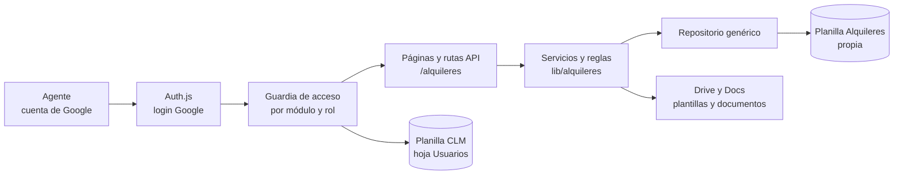

# PRD v2.1 — Módulo de Gestión de Alquileres dentro del CLM de Asuntos Jurídicos (EPESF)

Fecha: 30/09/2026 · Autor: Carlos Guillermo Paganini (GAJ) · Estado: borrador para revisión · Versión 2.1: incorpora las decisiones de la ronda de puntos abiertos del 30/09/2026 (D9–D15, sección 1)
Reemplaza la arquitectura del PRD v1 (24/09/2026, Apps Script + Google Sheets). Base de análisis: código de `clm-gaj-epe` (Next.js 16, commit inicial) leído el 30/09/2026, sin modificaciones.

## 0. Cómo leer este documento

**Este PRD v2 adapta el PRD v1 para construir la gestión de alquileres como un módulo dentro de la aplicación CLM existente, en lugar de una app independiente en Apps Script.** Cambian la arquitectura, la identidad, los roles, la capa de datos, las comunicaciones y las fases. El dominio no cambia.

Regla de precedencia: (1) este v2; (2) el PRD v1 (documento "PRD — App de Seguimiento de Gestión de Alquileres (EPESF)") en todo lo que este v2 no modifique; (3) el libro `Estructura_Datos_Gestion_Alquileres.xlsx` v0.1 como Anexo A. Las secciones 6 (reglas R1–R20 y estados), 7.2 (inmuebles, expedientes, personas), 8 (contenido del dashboard) y 9 (reportes RP-01 a RP-12) del v1 **rigen sin cambios**, salvo lo listado en las secciones 6 y 7 de este documento.

## 1. Decisiones de Carlos que fundan este v2

| # | Decisión | Fecha |
| --- | --- | --- |
| D1 | El módulo vive **dentro de la app Next.js del CLM**, con **planilla de Google Sheets propia** (separada de la del CLM). Apps Script se descarta. | 30/09 |
| D2 | Las actuaciones de alquiler son **independientes** de los contratos del CLM: sin vínculo de datos ni flujo compartido. Solo se guarda el enlace al escaneado firmado. | 30/09 |
| D3 | **Rol por módulo**: cada usuario tiene un rol en el CLM y otro, independiente, en Alquileres (ADMINISTRADOR, GESTOR, SUPERVISOR, LECTOR). Se amplía la hoja Usuarios. | 30/09 |
| D4 | Comunicaciones en v1: **la app genera el borrador y el envío es manual**. Las alertas se calculan al ingresar. El envío automático queda para una fase posterior. | 30/09 |
| D5 | **Grupo propio en el menú** con dashboard, calendario y alertas propios del módulo, sin mezclar eventos con los del CLM. | 30/09 |
| D6 | La app está desplegada en Vercel **con datos de prueba** (no hay datos reales en producción). | 30/09 |
| D7 | Los hallazgos de la app actual se corrigen en una **Fase 0 obligatoria**, antes de cargar datos personales de locadores. | 30/09 |
| D8 | Este PRD se entrega como **v2 nuevo**; el v1 queda como histórico. | 30/09 |
| D9 | **Titularidad de cuentas:** se acepta como riesgo que Google Cloud, Vercel, el repositorio y las planillas estén bajo las cuentas actuales (personales). EPE no tiene Workspace. No se exige migración. Mitigación mínima recomendada, no obligatoria: una segunda persona con acceso documentado a cada recurso. | 30/09 |
| D10 | **Datos personales:** el PRD fija una compuerta. Antes de la Fase 5 (datos reales), GAJ emite un dictamen interno sobre base legal del tratamiento, transferencia internacional, confidencialidad, seguridad e inscripción de la base ante la AAIP, si correspondiera. El desarrollo con datos ficticios no se frena. | 30/09 |
| D11 | **Cuenta de servicio:** una sola, compartida por el CLM y Alquileres. | 30/09 |
| D12 | **Accesos:** la hoja Usuarios del CLM, ampliada, es la hoja central de accesos, con columna de rol por módulo y `activo`. | 30/09 |
| D13 | **Respaldo:** manual, con recordatorio visible para los administradores. Sin tareas programadas en v1. | 30/09 |
| D14 | **Concurrencia:** sin bloqueo externo; control de versión y registro de conflictos. Se reevalúa a los 3 meses de uso real. | 30/09 |
| D15 | **Dominio:** la reiteración (H-03) se cuenta desde el mail inicial (H-01). En un legítimo abono se guarda el canon mensual y, además, el monto total reconocido. El código visible de la gestión es `ACT-####`. El resto de los puntos abiertos 4 a 13 del v1 usa su valor por defecto. | 30/09 |

Todas las decisiones de dominio del v1 (sección 2) siguen cerradas: canon mensual, IVA en neto para análisis, plazos de 5 y 7 días hábiles, adenda y legítimo abono sin flujo de hitos, NO_RENOVADO, ID generado por el sistema, vencimiento efectivo, etc.

## 2. Diagnóstico de la app existente (base del v2)

**El CLM es una app Next.js 16 (App Router) + React 19 + Tailwind 4 + Radix, con login Google (Auth.js), datos en Google Sheets vía cuenta de servicio y despliegue en Vercel.** Su modelo es un `Contrato` que avanza por 12 etapas, con 9 roles y una matriz rol × etapa.

### Qué se reutiliza

Login y tabla Usuarios; `AppShell`, sidebar (la navegación es data-driven en `lib/navegacion.ts`) y UI kit; componentes de dominio (`KpiCard`, `Alert`, semáforo, calendario); Recharts; patrón de catálogos editables; historial/auditoría; cliente de Sheets (`google-auth-library` + `fetch`).

### Qué no se puede reutilizar tal cual

| Elemento actual | Problema para Alquileres | Tratamiento en v2 |
| --- | --- | --- |
| `types.ts`, `ETAPAS_ORDEN`, `Contrato` | Modelo de un solo agregado con etapas lineales; Alquileres es Inmueble → Expediente → Actuación con hitos por plazo. | Dominio nuevo e independiente en `lib/alquileres/`. No se extiende `Contrato`. |
| `ContratosProvider` | Una interfaz por entidad; `listar()` lee 5 hojas completas en cada request. | Capa de datos genérica por tabla, con lectura en lote (`batchGet`). |
| `RolId` (unión fija) y `permisos.ts` | Un rol por usuario; matriz por etapa. | Roles y permisos propios del módulo (sección 4). |
| `auth.ts` → `signIn` | Rechaza a quien no esté en Usuarios con rol CLM; la sesión exige `rolId`. | Se generaliza a roles por módulo (sección 4). |
| `NAV_GROUPS` | Estático y sin filtro por rol/módulo. | Se filtra por acceso a cada módulo. |
| `fechas.ts` | Sin días hábiles ni feriados; semáforo fijo 7/30 días; usa `new Date("yyyy-mm-dd")` (ver hallazgo H6). | El módulo usa su propio módulo de fechas (sección 5). No se modifica el semáforo del CLM. |
| `generarIdExpediente()` | Usa `Math.random()`; puede colisionar. | IDs del módulo por secuencia atómica (sección 5). |

## 3. Fase 0 — correcciones obligatorias previas en el CLM

**Ningún dato personal de locadores se carga hasta cerrar F0-1 a F0-7 y contar con el dictamen de GAJ (D10).** Son problemas de la app actual, verificados en el código el 30/09/2026.

| ID | Hallazgo | Acción requerida | Criterio de aceptación |
| --- | --- | --- | --- |
| F0-1 (crítico) | `GET /api/contratos` y `GET /api/contratos/[id]` no llaman a `requerirSesion()`, y `proxy.ts` excluye `/api` del matcher: lectura sin login de todos los contratos. | Exigir sesión en todo handler de `/api`; filtrar por rol con `listarVisibles()`. Convención: **ningún handler sin guardia explícita**; un test recorre las rutas y falla si alguna no la tiene. | Petición anónima a cualquier ruta `/api/*` (excepto `/api/auth/*`) devuelve 401. |
| F0-2 | `scripts/setup-sheet.mjs` crea la hoja Contratos con `link_texto_final` y `link_pdf`, que `sheets-schema.ts` no tiene: columnas corridas al leer. El instructivo tampoco lista Anotaciones ni Garantias. | Verificar la planilla real del CLM; corregir el desfase; hacer que el script **importe** el esquema (fuente única) en lugar de duplicarlo. | Test que compara encabezados del script contra el esquema; lectura de una fila real correcta. |
| F0-3 | README e INSTRUCTIVO dicen que no hay conexión a Sheets/Vercel, pero hay variables y proyecto Vercel. | Actualizar ambos documentos al estado real. | Documentos coherentes con el despliegue. |
| F0-4 | `MOCK_USUARIOS` tiene una cuenta real como administrador dentro del código. | Mock solo con `NODE_ENV !== "production"`; en producción, sin Sheets configurado, la app no arranca. | En producción no existe usuario embebido en código. |
| F0-5 | `.gitignore` con cambios sin commitear (`.env*`, `.vercel`); un único commit; sin ramas. | Commitear, definir ramas (main protegida + desarrollo) y verificar que ningún secreto esté en el historial. | `git log -p` sin credenciales. |
| F0-6 | Sin pruebas automáticas (no hay framework de test en `package.json`). | Incorporar un framework de pruebas (por ejemplo Vitest) y correrlas en CI antes de cada despliegue. | Pipeline que falla ante una regla rota. |
| F0-7 | Fechas `yyyy-mm-dd` interpretadas con `new Date()` (UTC): en navegadores de Argentina pueden mostrarse o contarse un día antes; `new Date().toISOString().slice(0,10)` da "mañana" después de las 21:00. | Tratar fechas de calendario como texto `yyyy-mm-dd` y operar sin conversión horaria. Corregir en el CLM lo que afecte vencimientos. | Test de `diasRestantes` y `formatearFecha` con zona horaria America/Argentina/Buenos_Aires. |

### Pruebas técnicas de la Fase 0 (reemplazan las del v1)

| Prueba | Qué verifica | Resultado que habilita |
| --- | --- | --- |
| a | Login con una cuenta `@gmail.com` personal y con una de Workspace, ambas en la lista blanca. | Confirma que el punto abierto 1 del v1 queda resuelto por Auth.js. |
| b | Lectura y escritura de 4.000 filas simuladas de hitos con `batchGet` y escritura por lotes; medición de cuota de la API de Sheets con 10 usuarios simultáneos. | Se confirma rendimiento y necesidad de caché. |
| c | Generación de un contrato con tres locadores desde una plantilla de Google Docs usando la cuenta de servicio (APIs de Docs y Drive), en una carpeta compartida. | Se confirma que la cuenta de servicio puede copiar y completar plantillas y dónde queda la propiedad de los archivos. |
| d | Generación simultánea de 20 IDs desde procesos concurrentes y escritura multi-fila con `spreadsheets.batchUpdate`. | Se confirma que no hay IDs repetidos y que una escritura multi-fila se aplica completa o no se aplica. |

## 4. Arquitectura y stack

**El módulo es un conjunto de páginas, rutas de API y librerías dentro del proyecto `clm-gaj-epe`, con su propia planilla de Google Sheets; la app sigue siendo el único punto de acceso a los datos.**

### Stack

| Capa | Tecnología | Notas |
| --- | --- | --- |
| Aplicación | Next.js 16 (App Router), React 19, TypeScript, Tailwind 4, Radix | Es un Next.js con cambios incompatibles: **antes de escribir código, leer la guía de `node_modules/next/dist/docs/`** (lo exige `AGENTS.md`). |
| Base de datos | Google Sheets, **planilla separada**: variable `GOOGLE_SHEETS_ALQUILERES_ID` | Misma convención de hojas y columnas del Anexo A + cambios M1–M14 (sección 6). Una única cuenta de servicio compartida con el CLM, con acceso de editor a ambas planillas (D11). Mitigación: cada repositorio recibe solo el ID de su planilla y una prueba automática verifica que el módulo no lee ni escribe en la planilla del otro (T26). |
| Identidad | Auth.js con proveedor Google (ya implementado) | Acepta cualquier cuenta de Google; la lista blanca decide. |
| Documentos | Google Docs + Drive vía cuenta de servicio | Reemplazan a AutoCrat. La carpeta de plantillas y salida debe compartirse con la cuenta de servicio. |
| Gráficos | Recharts (ya instalado) | Reemplaza a Chart.js del v1. |
| Exportaciones | XLSX y CSV generados en el servidor; PDF mediante la impresión del navegador con hoja de estilos de impresión | Cambio respecto del v1 por simplicidad de despliegue. |
| Ambientes | Desarrollo local (mock), preview y producción en Vercel | IDs de planilla y credenciales solo en variables de entorno. |

### Estructura de código

- `src/app/alquileres/**` (páginas) y `src/app/api/alquileres/**` (rutas).
- `src/lib/alquileres/{tipos,esquema,repositorio,reglas,servicios,permisos,fechas}.ts`. Las reglas R1–R20 son funciones puras sin dependencias de Next ni de Sheets, para poder probarlas.
- `src/components/alquileres/**`, reutilizando `components/ui` y `components/domain`.
- `scripts/setup-sheet-alquileres.mjs`: debe **importar** el esquema de `lib/alquileres/esquema.ts` (F0-2), no duplicarlo.

### Identidad y roles por módulo (reemplaza la sección 3 "Identidad" y RA del v1)

1. **Hoja Usuarios del CLM, ampliada** con las columnas `rol_alquileres` (vacío = sin acceso al módulo) y `activo` (vacío se interpreta como activo, para no romper lo existente). `rol_id` se conserva como rol CLM para no romper el CLM y puede quedar vacío. Esta hoja es la hoja central de accesos (D12): si se suman módulos, cada uno agrega su columna de rol.
2. **Acceso a la app** = existir en Usuarios y tener rol en al menos un módulo. Se modifica `signIn` y el token de sesión para cargar `rolesPorModulo`; hoy exige un `rolId` del CLM.
3. **Reglas RA-1 a RA-6 del v1 se mantienen**, leyendo USUARIOS como esta hoja ampliada. La cuenta de Google manda; el dominio no.
4. **Guardia del módulo**: toda página y ruta bajo `alquileres` exige sesión y rol de Alquileres. Un usuario sin `rol_alquileres` no ve el grupo de menú, y la ruta devuelve 403. Un usuario solo de Alquileres no accede a pantallas del CLM.
5. **Enmascarado de LECTOR (RA-3)** se aplica en el servidor antes de serializar, incluido lo que viaja a componentes de cliente.
6. **Gestión de accesos**: el ADMINISTRADOR de Alquileres edita solo `rol_alquileres` y `activo` desde el módulo; los roles del CLM siguen editándose en la planilla. La función de escritura del módulo solo puede modificar esas dos columnas, con prueba automática (T27).
7. La matriz de permisos de la sección 3 del v1 se conserva sin cambios.

### Integridad, concurrencia y rendimiento (reemplaza el apartado del v1)

**Sheets no ofrece bloqueos ni transacciones; en Vercel no existe un bloqueo global como `LockService`.** Por eso:

1. **IDs por secuencia atómica**: cada prefijo tiene una hoja de secuencia donde la app agrega una fila; el número del ID es la fila asignada por la propia API al agregar. Nunca se reutilizan (R1). `CONTADORES` del v1 pasa a ser informativa.
2. **Control optimista**: cada tabla editable tiene `version`. Al guardar, el servidor relee la fila, compara `version` y rechaza con "otro usuario modificó este registro" si difiere. Queda una ventana de milisegundos entre lectura y escritura: se acepta para GAJ (hasta 15 usuarios) y se monitorea en LOG_CAMBIOS. Si aparecen conflictos reales, se evalúa un bloqueo externo.
3. **Escrituras multi-fila** (por ejemplo R3a, insertar un legítimo abono en la cadena) mediante una única llamada `spreadsheets.batchUpdate`, que se valida y aplica completa o no se aplica. Se verifica en la prueba d.
4. **Lectura en lote** con `batchGet` y caché en memoria de corta vigencia (máximo 60 s) invalidada en cada escritura. En un entorno sin servidor la caché es por instancia: un usuario puede ver datos de hasta 60 s de antigüedad; el dashboard muestra el sello "Datos al …".
5. Toda escritura pasa por el repositorio del servidor. Las páginas son de servidor con `force-dynamic` para lo que cambia.
6. Las cuotas de la API de Sheets se verifican en la documentación oficial al iniciar (prueba b).

## 5. Fechas, días hábiles y semáforo del módulo

1. Las fechas de calendario se guardan y operan como texto `yyyy-mm-dd`, sin conversión horaria. Las marcas de tiempo se guardan en ISO con zona America/Argentina/Buenos_Aires.
2. El módulo tiene su propio `fechas.ts`: días hábiles, feriados (tabla FERIADOS), R13, semáforo con los umbrales de PARAMETROS (180/120/60). **No se toca el semáforo del CLM.**
3. "Hoy" se calcula siempre en zona America/Argentina/Buenos_Aires, tanto en servidor como en cliente.
4. Formato visible dd/mm/aaaa; pesos con separador de miles y coma decimal.

## 6. Cambios al modelo de datos y reglas respecto del v1

Se mantienen M1–M14 y R1–R20 del v1, con estos ajustes:

| # | Elemento | Ajuste |
| --- | --- | --- |
| M1' | USUARIOS | **Ya no es tabla de la planilla de Alquileres**: vive en la hoja Usuarios del CLM, ampliada (sección 4). Se conservan `activo` y registro de cambios; `ultimo_acceso` es deseable (S). |
| M3' | CONTADORES | Reemplazada por hojas de secuencia por prefijo (sección 4). |
| M15 (nuevo) | Todas las tablas editables | Se agrega `version` (entero) al final para el control optimista. |
| M16 (nuevo) | COMUNICACIONES | Estados: BORRADOR y ENVIADO (envío declarado por el usuario). Se elimina ERROR. `id_mensaje_gmail` queda opcional y vacío en v1. Se agrega `envio_declarado_por` y `envio_declarado_en`. |
| M17 (nuevo) | LOG_CAMBIOS | Además de lo del v1, registra conflictos de versión. Se protege la hoja para que solo la cuenta de servicio escriba. |
| M18 (nuevo) | ACTUACIONES (LEGITIMO_ABONO) | Agregar al final `monto_total_reconocido` (número, opcional): monto global que figura en el acto administrativo. `canon_inicial` sigue siendo el monto **mensual**. RP-05 muestra ambos y marca diferencias con meses × mensual. | D15 |
| R13' | Días hábiles | Se calculan con el `fechas.ts` del módulo; los casos T3 a T5 del v1 siguen siendo la prueba. |

## 7. Requerimientos funcionales: cambios respecto del v1

| ID v1 | Cambio |
| --- | --- |
| RF-01, RF-02 | Se implementan con la guardia por módulo (sección 4). Criterio adicional: usuario con `rol_alquileres` vacío recibe 403 y el grupo de menú no aparece. |
| RF-03 | Buscador global dentro del módulo. No busca en datos del CLM. |
| RF-22 | Sin cambios: prepara el aviso con destinatarios de CONTACTOS_EPE vigentes. |
| **RF-23 [CAMBIO]** | La app genera **asunto, destinatarios y cuerpo**; ofrece "Copiar" y "Abrir en Gmail" (enlace de redacción con el texto precargado, o copia al portapapeles si el cuerpo es demasiado largo). El envío lo hace el gestor desde su casilla. Luego el gestor usa "Marcar como enviado", con fecha (no futura); recién entonces se guarda ENVIADO y se cumple H-01. Criterio: sin "Marcar como enviado", H-01 sigue pendiente. |
| **RF-24 [CAMBIO]** | La reiteración (H-03) se prepara como texto para responder manualmente en el hilo del aviso; se registra igual que RF-23. La carta documento se registra como en el v1. |
| RF-25 a RF-29 | Generación de documentos con Docs/Drive mediante la cuenta de servicio (prueba c). Las etiquetas y reglas se mantienen. |
| **RF-30 [CAMBIO]** | Pasa de S a **C (posterior)**: el acceso a la carpeta de documentos lo administra manualmente el ADMINISTRADOR de Drive; automatizarlo exigiría permisos de Drive más amplios para la cuenta de servicio. |
| **RF-39 [CAMBIO]** | Respaldo **manual** (D13): botón del ADMINISTRADOR que copia la planilla a la carpeta de respaldos de Drive con fecha en el nombre y conserva `retencion_backups_dias`. El dashboard del ADMINISTRADOR muestra "Último respaldo: hace N días" y la alerta **A8** cuando pasan más de 7 días sin respaldo. Se suma el historial de versiones de Sheets como defensa. |
| **RF-40 (nuevo, S)** | **Calendario propio del módulo**: vencimientos efectivos e hitos previstos, con semáforo y filtros del dashboard. Puede reutilizar el componente visual de calendario del CLM con un adaptador; si el tipo de evento actual lo impide, se construye uno propio sin alterar el del CLM. |
| **RF-41 (nuevo, M)** | **Menú propio**: grupo "Alquileres" en el sidebar con Dashboard, Inmuebles, Expedientes, Actuaciones, Personas, Calendario, Alertas, Reportes y Administración, filtrado por rol. |
| **RF-42 (nuevo, M)** | **Cobertura de rutas**: prueba automática que recorre `app/api/alquileres/**` y falla si un handler no valida sesión y rol. |

### Resumen diario por mail (v1, sección 9): pasa a fase posterior

Con D4, en v1 no hay envío automático. Las alertas se ven al ingresar (dashboard, cola de trabajo y calendario). El PRD deja especificado para la Fase 7: resumen diario desde una casilla institucional, con proceso programado.

## 8. Seguridad, auditoría y no funcionales: cambios respecto del v1

| ID | Ajuste |
| --- | --- |
| NF-S1 | La autorización ocurre en el servidor en cada página y ruta (RF-42). Ningún dato de rol viaja desde el navegador como fuente de verdad. |
| NF-S2 | La planilla del módulo y las carpetas de plantillas y respaldos no se comparten con los agentes por Drive; solo la cuenta de servicio y los administradores de Drive acceden. |
| NF-S3 | Alcances de Google mínimos: Sheets, y Docs/Drive limitados a lo necesario; se justifica cada uno en el README. |
| NF-S4, NF-S5 | Se mantienen. Contra XSS: prohibido `dangerouslySetInnerHTML` con datos de usuario; React escapa por defecto. |
| NF-S6 | Sin secretos en el código ni en el repositorio: variables de entorno de Vercel. La clave de la cuenta de servicio se rota si alguna vez salió del entorno. |
| NF-S8 | **Compuerta jurídica (D10):** antes de la Fase 5, dictamen interno de GAJ sobre base legal del tratamiento, transferencia internacional (Google y Vercel), confidencialidad, seguridad y eventual inscripción de la base ante la AAIP. Sin dictamen no se cargan datos reales. Los datos de locadores quedan en Google y en el proveedor de despliegue. El desarrollo con datos ficticios no se frena. |
| NF-02 | Concurrencia: 10 usuarios simultáneos sin IDs repetidos y con detección de conflicto de versión (prueba d). |
| NF-03 | Disponibilidad: depende de Vercel y de Google; la app agrega dependencias externas respecto del v1. |
| NF-08 | Observabilidad: errores del servidor a una hoja ERRORES visible al ADMINISTRADOR, sin datos personales. |
| NF-11 (nuevo) | Fechas: ninguna función de negocio usa `new Date("yyyy-mm-dd")` ni `toISOString().slice(0,10)` para fechas de calendario. |
| NF-12 (nuevo) | Aislamiento: un error o cuota agotada en la planilla de Alquileres no debe impedir el uso del CLM, y viceversa. |

### Tareas programadas (reemplaza la tabla del v1)

| Tarea | Frecuencia | Estado |
| --- | --- | --- |
| Respaldo de la planilla | Manual (D13), con recordatorio en el dashboard (alerta A8) | Ver RF-39. |
| Verificación de cadenas, contadores y feriados (A7) | Al ingresar el ADMINISTRADOR | Sin tareas programadas en v1. |
| Resumen diario por mail | — | Fase posterior. |

## 9. Fases y pruebas (reemplazan la sección 11 del v1)

| Fase | Contenido | Condición de salida |
| --- | --- | --- |
| 0. Correcciones y pruebas técnicas | F0-1 a F0-7 y pruebas a–d (sección 3). | Criterios de aceptación de F0 cumplidos. |
| 1. Cimientos del módulo | Roles por módulo y guardia; menú filtrado; capa de datos genérica; planilla de Alquileres y script de creación desde el esquema; catálogos; IDs y control de versión; validaciones; LOG_CAMBIOS; ABM de inmuebles, expedientes, personas y actuaciones. | Pruebas de permisos e integridad R1–R12, R3', R4', RF-42 y concurrencia. |
| 2. Hitos, alertas y dashboard | Como el v1, con `fechas.ts` del módulo, calendario (RF-40) y alertas propias. | Los ejemplos numéricos T2–T10 dan el resultado esperado. |
| 3. Comunicaciones y documentos | Borradores de aviso y reiteración, "Marcar como enviado", contratos y adendas desde plantilla, enlace del firmado, actos. | Se generan los borradores y contratos de los casos reales de la UAT. |
| 4. Reportes y operación | RP-01 a RP-12, exportaciones XLSX/CSV, impresión a PDF, respaldo, pantalla de errores. | Cifras de reportes = dashboard; restauración de un respaldo. |
| 5. Piloto y carga inicial | **Precondición: dictamen de GAJ emitido (D10).** Carga de contratos vigentes y en curso; uso paralelo con el Excel. | Sin hallazgos críticos; A5 y A1 muestran los casos que Carlos reconoce. |
| 6. Migración histórica | Saneamiento y migración de *Datos Renovaciones* y *Alq*, con conciliación y `codigo_legado`. | Cada fila migrada conciliada. |
| 7. Posterior | Envío automático de mails, resumen diario, vista unificada con el CLM, permisos de Drive automáticos. | A definir. |

### Pruebas nuevas o modificadas (se suman a T1–T17 del v1)

| # | Caso | Resultado esperado |
| --- | --- | --- |
| T1' | 20 altas simultáneas de actuaciones. | 20 IDs distintos y consecutivos. |
| T16' | Cuenta de Google válida pero sin fila en Usuarios, o con `rol_alquileres` vacío. | Sin acceso al módulo; intento registrado; sin datos en la respuesta. |
| T18 | Petición anónima a cualquier ruta `/api/*` del CLM y de Alquileres. | 401. |
| T19 | Usuario solo con rol CLM entra a `/alquileres`; usuario solo con rol Alquileres entra a `/contratos`. | 403 en ambos. |
| T20 | Dos usuarios editan la misma actuación a la vez. | El segundo recibe conflicto de versión; ningún dato se pierde en silencio. |
| T21 | Comparación de encabezados del script de creación contra el esquema. | Idénticos. |
| T22 | `diasRestantes`/`hoy` con zona America/Argentina/Buenos_Aires a las 22:00. | Fecha y conteo correctos. |
| T23 | "Marcar como enviado" sin fecha o con fecha futura. | Rechazado; H-01 sigue pendiente. |
| T24 | Un error forzado en la API de la planilla de Alquileres. | El CLM sigue operando. |
| T25 | Sin respaldo hace más de 7 días. | El ADMINISTRADOR ve la alerta A8; tras un respaldo, desaparece. |
| T26 | El repositorio de Alquileres intenta leer o escribir en la planilla del CLM, y viceversa. | La prueba automática falla: cada repositorio solo opera sobre su planilla. |
| T27 | El módulo intenta escribir una columna de Usuarios distinta de `rol_alquileres` o `activo`. | Rechazado. |
| T28 | Legítimo abono con mensual y monto total reconocido distintos de meses × mensual. | Se guardan ambos valores y RP-05 marca la diferencia. |

UAT y definición de terminado: sin cambios respecto del v1 (casos A y B de EJEMPLO_CARGA).

## 10. Riesgos y puntos abiertos

### Puntos abiertos resueltos en la versión 2.1

| # | Punto | Resolución |
| --- | --- | --- |
| 1 | Titularidad de las cuentas | Riesgo aceptado (D9). |
| 2 | Datos personales de locadores | Compuerta: dictamen interno de GAJ antes de la Fase 5 (D10). |
| 3 | Cuenta de servicio | Una compartida (D11). |
| 4 | Administración de usuarios | Hoja Usuarios del CLM ampliada, como hoja central de accesos (D12). |
| 5 | Respaldo | Manual con recordatorio y alerta A8 (D13). |
| 6 | Bloqueo externo | No; revisión a los 3 meses (D14). |
| 7 | Puntos 3 a 13 del v1 | Decididos 3, 5 y 7 (D15); el resto usa el valor por defecto del v1. |

### Puntos abiertos remanentes

| # | Punto | Responsable / valor por defecto | Prioridad |
| --- | --- | --- | --- |
| 1 | **Dictamen interno de GAJ** sobre datos personales (D10). Precondición de la Fase 5. | Carlos / GAJ. Sin valor por defecto: sin dictamen no hay datos reales. | Alta |
| 2 | **Términos del plan de Vercel.** El plan Hobby está pensado, según entiendo, para uso personal y no comercial; no lo verifiqué. | Revisar los términos antes de alojar la app en producción; si no corresponde, plan Pro. | Media |
| 3 | Mitigación mínima de la titularidad (D9): segunda persona con acceso documentado a Google Cloud, Vercel, repositorio y planillas, y respaldo semanal. | Recomendada, no obligatoria. | Media |
| 4 | Feriados: confirmar si se incluyen los días no laborables con efecto administrativo (punto 11 del v1). | Nacionales y provinciales de Santa Fe. | Baja |

Los puntos abiertos 1 y 2 del v1 quedan **resueltos**: Auth.js acepta cuentas Gmail personales, y el envío desde casilla institucional se pospone (D4).

### Riesgos nuevos o modificados

| Riesgo | Efecto | Mitigación |
| --- | --- | --- |
| Se suma un módulo con datos personales sobre una base con huecos de seguridad. | Exposición de datos de locadores. | Fase 0 obligatoria (D7) y RF-42. |
| Fechas interpretadas con desfase horario. | Vencimientos mal calculados, con consecuencia jurídica. | Sección 5, F0-7, T22, NF-11. |
| Sin bloqueo global en Vercel. | IDs repetidos o pisado de registros. | IDs por secuencia atómica, versión optimista, batchUpdate, pruebas d, T1', T20. |
| Envío manual de mails. | El hito puede declararse cumplido sin que el mail salga; no hay acuse. | Fecha obligatoria, registro de quién declaró, RP-06 rotulado "envío declarado"; envío automático en Fase 7. |
| Plantillas con cuenta de servicio. | Propiedad y cuota de archivos en Drive; acceso a carpetas. | Prueba c; carpeta compartida institucional. |
| Cuotas de Sheets con una planilla más. | Lentitud o errores. | `batchGet`, caché corta, planilla separada (NF-12). |
| Un solo desarrollador y una sola rama. | Regresiones en el CLM. | F0-5, F0-6, pruebas de regresión del CLM en CI. |
| Cuentas personales como titulares de Google Cloud, Vercel, repositorio y planillas (D9, riesgo aceptado). | La app y los datos dejan de estar disponibles o de ser controlables por EPE si la cuenta se pierde, se suspende o su titular se va. | Mitigación recomendada, no obligatoria: segunda persona con acceso documentado y respaldos semanales. Riesgo aceptado por Carlos el 30/09/2026. |
| Respaldo manual (D13). | Una omisión deja sin copia los datos de las últimas semanas. | Alerta A8 visible para los ADMINISTRADORES tras 7 días sin respaldo. |
| Cuenta de servicio compartida (D11). | Una clave filtrada expone ambas planillas; un error en un módulo podría escribir en la planilla del otro. | Un repositorio por planilla, prueba T26, rotación de la clave ante cualquier sospecha. |

## 11. Anexo — qué cambia y qué no respecto del v1

| Sección v1 | Estado en v2 |
| --- | --- |
| 1 Resumen y objetivos | Sin cambios, salvo "Apps Script" por "módulo del CLM". |
| 2 Contexto y decisiones | Sin cambios; se suman D1–D8. |
| 3 Usuarios y roles | Roles y matriz sin cambios; identidad y USUARIOS modificados (sección 4 de este documento). |
| 4 Arquitectura | **Reemplazada** (secciones 4 y 5). |
| 5 Modelo de datos | M1–M14 con ajustes M1', M3', M15–M17. |
| 6 Reglas de negocio | Sin cambios; R13 con `fechas.ts` del módulo. |
| 7 Requerimientos | Cambios RF-23, RF-24, RF-30, RF-39; nuevos RF-40 a RF-42. |
| 8 Dashboard | Sin cambios de contenido; Recharts en lugar de Chart.js. |
| 9 Reportes | Sin cambios; PDF por impresión del navegador; sin resumen diario en v1. |
| 10 Seguridad y no funcionales | Modificada (sección 8). |
| 11 Fases y pruebas | **Reemplazada** (sección 9). |
| 12 Riesgos y puntos abiertos | Modificada (sección 10); puntos abiertos resueltos en v2.1. |
